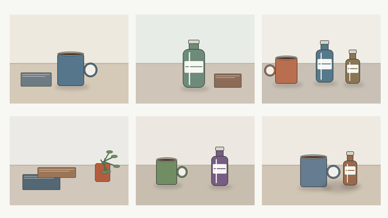

<picture>
  <source media="(prefers-color-scheme: dark)" srcset="docs/product/readme/brand-dark.svg">
  
</picture>

# AnnotAgent

**从原始图片到训练数据包的视觉数据 Agent。**

告诉 AnnotAgent 用哪些图片、标注什么、准备训练什么。LLM 组织视觉模型和处理工具，你在需要时检查与修正，再导出目标格式的数据。用于生成标注的模型，与之后准备训练的模型可以不同。

> Alpha · 本地单用户应用。需要配置模型；样例验证、正式审核和打包条件仍需确认。当前完整训练包仅支持 Ultralytics YOLO 检测预设，不执行模型训练。

[编译与启动](#编译与启动) · [配置模型](#配置-provider-endpoint-和-api-key) · [演示用例](#两个可执行演示) · [文档](docs/product/readme/GUIDE.md) · [English](README.en.md)


*真实 B-Human 样例截图，保留审核提示与只读状态。它证明保存的候选可以回看，不代表已完成正式审核或产出训练包；截图服务不是本轮最终集成版本。具体来源见[素材记录](docs/product/readme/ASSET_MANIFEST.json)。*

## 第一次体验



仓库提供一组离线可用的 6 图桌面物品示例，类别为 `cup` 和 `bottle`，
目标是生成 Ultralytics YOLO 检测数据包。所有图片都是明确标注的原创程序化
合成图，用于体验流程，不是摄影数据或训练效果基准。[查看素材、固定划分与许可](examples/demo-packs/object-detection-review/1.0.0/README.md)。

- **用我的模型试跑**：使用已配置并批准的模型；结果、Token 和费用来自本次实际请求。
- **免配置体验：预置候选**：不发生本次模型推理；检查并修改随示例提供的候选，再逐图审核和打包。

预置候选不能进入真实模式的模型提示词、输入或缓存。结构检查通过也不表示
标注精度通过。示例入口的产品截图将在最终集成版本产生后补充，当前素材图不冒充运行界面。

## 一次任务：从图片到数据包

以比赛图片中的 `ball` 检测为例，训练用途选择 Ultralytics YOLO 检测。以下四步说明同一任务应如何推进；现有真实截图只覆盖样例阶段，后两步的交付机制由代码及独立 TEST 证据支撑。

1. **描述目标。** 选定图片范围、定义足球的标注规则、填写训练用途。这三个信息项保存到当前任务；缺失时需要补全。保存目标不会自动授权外部调用。
2. **组合并试跑。** 规划模型根据可用能力提出方案。真实足球样例曾执行视觉定位与 EfficientSAM 提示分割；实际步骤以执行记录为准，不能从安装列表推断。检查样例后，再批准正式处理。
3. **人工协助。** 样例反馈用于调整方法。正式结果需要对象审核；整图确认还要判断是否有漏标、是否为负样本或应排除。接受一个框不等于整张图已完整。
4. **检查与打包。** 对支持的预设，Rust 根据固定图片范围、类别映射、审核记录和划分策略生成 ZIP。先满足就绪条件，再确认打包；不能把规划完成或一次 API 成功当成数据包完成。

[任务与审核说明](docs/product/readme/GUIDE.md) · [独立 TEST 审核与交付证据](docs/product/readme/EVIDENCE.md)

## 为什么不只是一次视觉 API 调用

- **按任务组合模型与工具。** LLM 提出方案，Rust 检查节点、输入输出和模型绑定。视觉定位、裁剪、局部识别与分割可以组合；不合法的方案不能直接发布。见[工作流说明](docs/WORKFLOW_MODEL.md)。
- **结果有来源，也可以修订。** 候选关联图片、运行、节点和来源产物；样例修改与正式标注分别保存。历史任务与执行记录可以回看。见[任务与审核说明](docs/product/readme/GUIDE.md)。
- **交付物由确定性代码生成。** 坐标转换、目录、映射和校验由导出器完成。结构有效不等于标注准确。见[支持范围与文件说明](docs/product/readme/GUIDE.md#导出范围)。

这些是面向视觉标注的专门机制，不意味着通用 Agent 无法实现相同能力。

## 编译与启动

目前推荐**从源码启动**。仓库固定 Rust **1.98.0**；Node.js 需要 **20.19+ 或 22.12+**，CI 使用 Node.js 22。请使用 npm 和仓库中的 `package-lock.json`。原生视觉模型还需要对应平台的 Plugin、兼容权重及运行库。

```bash
git clone git@github.com:oooscarx/AnnotAgent.git
cd AnnotAgent

# 安装前端依赖并生成生产前端
npm --prefix web ci
npm --prefix web run build

# 编译整个 Rust workspace
cargo build --locked --workspace --all-features
```

使用一个**可写**的工作区目录启动正式应用：

```bash
cargo run --locked -p annotagent -- \
  serve --workspace ./workspace --port 8787 --open
```

如果没有自动打开浏览器，访问 [http://127.0.0.1:8787/projects](http://127.0.0.1:8787/projects)。端口已占用时换一个端口，例如 `--port 8788`；多个服务不要共用同一个工作区。SQLite、任务记录、Provider 配置、凭证引用、标注和导出都保存在所选工作区中，因此该目录必须可写且不应提交到 Git。

只查看开发中的 Fixture 界面时可以运行 `npm --prefix web run dev:ui-preview`。**UI Preview 不连接真实工作区，不会调用模型，也不能作为端到端运行结果。**

### 配置 Provider Endpoint 和 API Key

1. 打开 **设置 → Providers 与账户**（`/settings/providers`），点击“添加 Provider”。可以选预设，也可以选择自定义 OpenAI-compatible Endpoint。
2. 填写显示名称和服务商提供的 Base URL，例如 `https://api.example.com/v1`。不要填 `/chat/completions`，不要在 Endpoint 中加入 API Key、用户名、查询参数或其他凭证。
3. 先保存账户，再打开该账户的编辑页。在“凭证存储”中选择一种方式：
   - **本地工作区文件（推荐）**：粘贴 API Key 并保存。密钥以 owner-only 权限写入当前工作区的 `.annotagent/credentials/`，被 Git 忽略，可跨重启使用；不会存入系统钥匙串或浏览器存储。
   - **服务器环境变量引用**：先在启动 AnnotAgent 的终端设置变量，再在界面里只填变量名，例如 `ANNOTAGENT_API_KEY`，不要把密钥填进“环境变量名称”。
   - **仅服务器当前进程**：重启后失效，适合临时测试。
4. 显式执行连接检查或模型发现。发现到远程模型 ID 只证明 Provider 返回了目录，不证明该模型能完成推理。

环境变量方式示例：

```bash
export ANNOTAGENT_API_KEY='replace-with-your-own-key'
cargo run --locked -p annotagent -- \
  serve --workspace ./workspace --port 8787 --open
```

README、TOML、项目名称和 Endpoint 中都不要写真实密钥。应用只显示凭证是否存在，不会把已保存密钥读回页面。

### 登记 Agent 模型和视觉模型

Provider 是账户连接，Model Profile 才是可选的具体模型，两者需要分别配置：

1. 在 **设置 → Agent 模型**（`/settings/agent-models`）添加规划模型，选择 Provider，填写服务商的精确模型 ID，并声明 `text` 输入和 `text_generation` 能力。工具调用、Structured Output 或 JSON Schema 仅在服务商实际支持时勾选。
2. 在 **设置 → 视觉模型与插件**（`/settings/vision-models`）添加 VLM，至少声明 `image` 输入以及实际具备的视觉能力，例如 Vision Language、Object Detection、Open-vocabulary Detection 或 Phrase Grounding。
3. 保存后启用模型，并执行显式测试。手工填写的能力在测试成功前仍是“用户声明”，不是可用性证据。
4. 在任务 Composer 中选择的 Agent 模型负责理解要求和规划；图片推理使用 Workflow 节点绑定的视觉模型。切换 Agent 模型不会把正在执行的 Workflow 视觉模型一并替换。

本地 EfficientSAM 等专家模型在同一“视觉模型与插件”页管理。`Plugin 已安装`、`Model Instance Ready` 和某次 Pipeline 中**实际执行过**是三个不同状态；请以任务执行轨迹和 Artifact 来源为准。

## 两个可执行演示

### 演示 1：离线检查候选并导出 YOLO ZIP

这个演示不需要 API Key，也不会发生模型推理。为避免影响已有项目，使用新的工作区：

```bash
cargo run --locked -p annotagent -- \
  serve --workspace ./workspace-demo --port 8789 --open
```

打开 `/projects` 后，在“第一次体验”中选择“体验预置候选”。AnnotAgent 会创建独立 Demo Project 和 Task，载入仓库自带的 6 张 `cup` / `bottle` 合成图片。逐图完成对象和整图审核，修正边界或漏框；满足就绪条件后生成并下载 Ultralytics YOLO Detection ZIP。界面会明确标注“本次无模型请求”，预置候选不能当成真实模型准确率证据。

### 演示 2：用真实模型标注足球

准备 1–5 张有权处理的比赛图片，创建项目并导入图片。确保规划模型、带图像输入的 VLM 已就绪；如果希望精修边界，还需安装兼容的 EfficientSAM Plugin 和 Model Instance。创建新任务后可直接使用下面的目标：

> 本次只标注项目图片中的足球 ball，用贴合球体的 bbox。不标机器人、鞋子、白线或点球点。先生成真实方案并测试最多 3 张样例，不启动全量处理。VLM 生成候选；坐标不可靠时检查局部目标，并在兼容且已就绪时使用 EfficientSAM 精修。保留几何校验和人工审核，禁止 mock/fixture。样例审核通过后处理这 5 张项目图片，逐图人工确认，并导出 Ultralytics YOLO Detection ZIP。

实际流程是：保存图片与目标 → 确认本次模型、图片、目的地和费用范围 → 自动生成方案并试跑样例 → 检查终端候选及执行轨迹 → 批准正式处理 → 逐图审核 → 生成并下载 ZIP。是否调用了 SAM 不能从提示词或安装列表推断；只有执行轨迹中出现对应节点和 Model Instance、且结果带有该 Artifact 来源，才算真正执行。

真实 Provider 会收到获准范围内的图片与文本并可能产生费用。费用未知时界面应显示“未知”，不是零；出现“远端结果未知”时先查看同一请求的执行记录，不要盲目重复收费调用。

## 开发检查

提交改动前建议运行与 CI 一致的核心检查：

```bash
cargo fmt --all --check
cargo clippy --workspace --all-targets --all-features -- -D warnings
cargo test --workspace --all-features
cargo build --locked --workspace --all-features

npm --prefix web run typecheck
npm --prefix web test
npm --prefix web run build
```

浏览器端到端测试使用 `npm --prefix web run test:e2e`，需要先满足相应测试服务和 Playwright 浏览器条件。具体架构、TUI 和离线 CLI Demo 参见[开发文档](docs/DEVELOPMENT.md)；本轮实际验证记录见[验证记录](docs/product/readme/VALIDATION.md)。

## 模型与导出支持

| 类型 | 当前范围 |
| --- | --- |
| Agent 规划模型 | 配置具备所需能力的模型；支持 OpenAI-compatible Provider。负责规划，不等于负责所有视觉推理。 |
| 视觉处理模型 | 通过注册能力与节点绑定使用 VLM、检测、分类、分割等实现；具体可用性取决于协议和模型。 |
| 本地 Plugin / Model Instance | Plugin 是执行实现，Model Instance 绑定具体权重与契约。已登记、已安装、Ready、真实运行过是不同状态。 |
| 标注文件导出 | Native、COCO、YOLO、LabelMe，受标注类型兼容性限制；可能丢失部分来源或属性。 |
| 完整训练数据包 | 当前为 `ultralytics_yolo_detection`：原图、YOLO TXT、`data.yaml`、README 和 AnnotAgent 来源、划分、排除、校验记录。其他标注导出格式不等于支持完整训练包。 |

真实 EfficientSAM-Ti 有 macOS ARM64 CPU 验证记录；其他模型与平台需要分别核实。Ready 表示已满足对应安装检查，不保证任务准确率。[模型接入](docs/PROVIDER_MODEL_REGISTRY.md) · [本地模型要求](docs/REAL_MODEL_RELEASE.md)

## 技术结构

<picture>
  <source media="(max-width: 600px) and (prefers-color-scheme: dark)" srcset="docs/product/readme/flow-mobile-dark.svg">
  <source media="(max-width: 600px)" srcset="docs/product/readme/flow-mobile-light.svg">
  <source media="(prefers-color-scheme: dark)" srcset="docs/product/readme/flow-dark.svg">
  
</picture>

*这是职责示意，不是每张图片都会执行全部节点的实际 Pipeline。Rust 负责主控、验证和导出，React/TypeScript 提供交互，SQLite 与文件保存本地记录。*

## 限制、隐私与贡献

- 面向本地单用户的图像任务；不提供自动训练、视频标注或云端多人协作。不要将本地服务直接暴露到公网。
- 工作区在本地，**远程 Provider 仍会收到本次调用涉及的图片或文本**。原图可能包含元数据，不能假定导出自动去除全部私人信息。
- 停止请求不保证远端调用立即终止或退款。未知结果不会作为成功，也不应盲目重试；继续执行受原授权、状态和剩余预算约束。
- 自动打包需要完整的服务端授权与触发链路；当前不承诺最后一次审核后自动交付。分割 Mask 的表达、绘制与编辑存在格式边界。
- 请以自己的代表性图片验证质量。几何与文件结构检查不保证无漏标、无误标。

[已知限制](docs/KNOWN_LIMITATIONS.md) · [安全说明](docs/SECURITY.md) · [开发与贡献](docs/DEVELOPMENT.md) · [问题反馈](https://github.com/oooscarx/AnnotAgent/issues)

许可：Cargo 元数据声明 MIT，但当前未找到仓库根目录 LICENSE 正文，需维护者补齐后确认再分发。模型权重与数据集遵循各自许可，不能沿用应用的许可推定。
