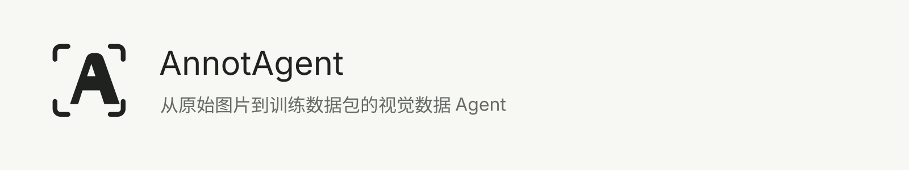
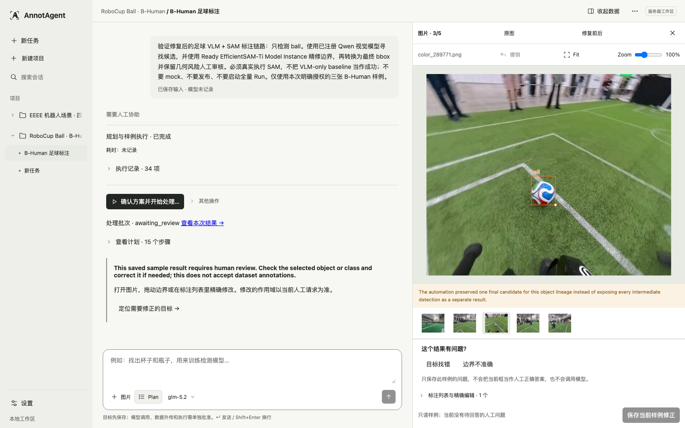
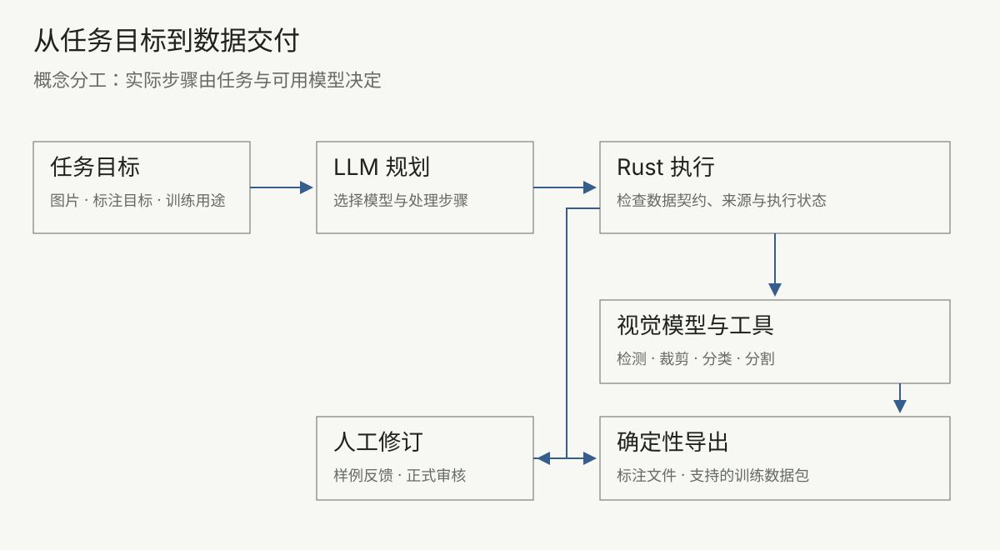

<picture>
  <source media="(prefers-color-scheme: dark)" srcset="docs/product/readme/brand-dark.svg">
  
</picture>

# AnnotAgent

**从原始图片到训练数据包的视觉数据 Agent。**

告诉 AnnotAgent 用哪些图片、标注什么、准备训练什么。LLM 组织视觉模型和处理工具，你在需要时检查与修正，再导出目标格式的数据。用于生成标注的模型，与之后准备训练的模型可以不同。

> Alpha · 本地单用户应用。需要配置模型；样例验证、正式审核和打包条件仍需确认。当前完整训练包仅支持 Ultralytics YOLO 检测预设，不执行模型训练。

[开始使用](#开始使用) · [任务示例](#一次任务从图片到数据包) · [文档](docs/product/readme/GUIDE.md) · [English](README.en.md)



*真实 B-Human 样例截图，保留审核提示与只读状态。它证明保存的候选可以回看，不代表已完成正式审核或产出训练包；截图服务不是本轮最终集成版本。具体来源见[素材记录](docs/product/readme/ASSET_MANIFEST.json)。*

## 一次任务：从图片到数据包

以比赛图片中的 `ball` 检测为例，训练用途选择 Ultralytics YOLO 检测。以下四步说明同一任务应如何推进；现有真实截图只覆盖样例阶段，后两步的交付机制由代码及独立 TEST 证据支撑。

1. **描述目标。** 选定图片范围、定义足球的标注规则、填写训练用途。这三个信息项保存到当前任务；缺失时需要补全。保存目标不会自动授权外部调用。
2. **组合并试跑。** 规划模型根据可用能力提出方案。真实足球样例曾执行视觉定位与 EfficientSAM 提示分割；实际步骤以执行记录为准，不能从安装列表推断。检查样例后，再批准正式处理。
3. **人工协助。** 样例反馈用于调整方法。正式结果需要对象审核；整图确认还要判断是否有漏标、是否为负样本或应排除。接受一个框不等于整张图已完整。
4. **检查与打包。** 对支持的预设，Rust 根据固定图片范围、类别映射、审核记录和划分策略生成 ZIP。先满足就绪条件，再确认打包；不能把规划完成或一次 API 成功当成数据包完成。

[任务与审核说明](docs/product/readme/GUIDE.md) · [独立 TEST 审核与交付证据](docs/product/readme/EVIDENCE.md)

## 为什么不只是一次视觉 API 调用

- **按任务组合模型与工具。** LLM 提出方案，Rust 检查节点、输入输出和模型绑定。视觉定位、裁剪、局部识别与分割可以组合；不合法的方案不能直接发布。见[工作流说明](docs/WORKFLOW_MODEL.md)。
- **结果有来源，也可以修订。** 候选关联图片、运行、节点和来源产物；样例修改与正式标注分别保存。历史任务与执行记录可以回看。见[任务与审核说明](docs/product/readme/GUIDE.md)。
- **交付物由确定性代码生成。** 坐标转换、目录、映射和校验由导出器完成。结构有效不等于标注准确。见[支持范围与文件说明](docs/product/readme/GUIDE.md#导出范围)。

这些是面向视觉标注的专门机制，不意味着通用 Agent 无法实现相同能力。

## 开始使用

目前推荐**从源码启动**。仓库固定 Rust **1.98.0**；Node.js 推荐 **22.12 或更高**，使用 npm 和仓库锁文件。原生推理还需要相应平台依赖与兼容权重。

```bash
npm --prefix web ci
npm --prefix web run build
cargo run --locked -p annotagent -- serve --workspace ./workspace --open
```

打开 [本地工作台](http://127.0.0.1:8787)，新建项目并进入任务。通过 Settings 配置自己的 Provider Endpoint、API Key 与模型；说明图片范围、标注目标和训练用途，按任务提示补全信息、确认样例与正式处理。缺少模型能力时先完成准备，再返回原任务。

- **源码启动**连接 Rust 服务与本地工作区；页面打开不代表模型推理已验证。
- **UI Preview**是开发用预览数据界面，不是实际模型执行环境；参见[开发文档](docs/DEVELOPMENT.md)。
- **真实模型调用**需要自己的模型连接或兼容本地权重，并确认请求范围和费用。仓库不包含全部生产权重。

本轮实际执行的命令及结果见[验证记录](docs/product/readme/VALIDATION.md)，不将已有工程测试视为本轮重跑。

## 模型与导出支持

| 类型 | 当前范围 |
| --- | --- |
| Agent 规划模型 | 配置具备所需能力的模型；支持 OpenAI-compatible Provider。负责规划，不等于负责所有视觉推理。 |
| 视觉处理模型 | 通过注册能力与节点绑定使用 VLM、检测、分类、分割等实现；具体可用性取决于协议和模型。 |
| 本地 Plugin / Model Instance | Plugin 是执行实现，Model Instance 绑定具体权重与契约。已登记、已安装、Ready、真实运行过是不同状态。 |
| 标注文件导出 | Native、COCO、YOLO、LabelMe，受标注类型兼容性限制；可能丢失部分来源或属性。 |
| 完整训练数据包 | 当前为 `ultralytics_yolo_detection`：原图、YOLO TXT、`data.yaml`、README 和 AnnotAgent 来源、划分、排除、校验记录。其他标注导出格式不等于支持完整训练包。 |

真实 EfficientSAM-Ti 有 macOS ARM64 CPU 验证记录；其他模型与平台需要分别核实。Ready 表示已满足对应安装检查，不保证任务准确率。[模型接入](docs/PROVIDER_MODEL_REGISTRY.md) · [本地模型要求](docs/REAL_MODEL_RELEASE.md)

## 技术结构

<picture>
  <source media="(max-width: 600px) and (prefers-color-scheme: dark)" srcset="docs/product/readme/flow-mobile-dark.svg">
  <source media="(max-width: 600px)" srcset="docs/product/readme/flow-mobile-light.svg">
  <source media="(prefers-color-scheme: dark)" srcset="docs/product/readme/flow-dark.svg">
  
</picture>

*这是职责示意，不是每张图片都会执行全部节点的实际 Pipeline。Rust 负责主控、验证和导出，React/TypeScript 提供交互，SQLite 与文件保存本地记录。*

## 限制、隐私与贡献

- 面向本地单用户的图像任务；不提供自动训练、视频标注或云端多人协作。不要将本地服务直接暴露到公网。
- 工作区在本地，**远程 Provider 仍会收到本次调用涉及的图片或文本**。原图可能包含元数据，不能假定导出自动去除全部私人信息。
- 停止请求不保证远端调用立即终止或退款。未知结果不会作为成功，也不应盲目重试；继续执行受原授权、状态和剩余预算约束。
- 自动打包需要完整的服务端授权与触发链路；当前不承诺最后一次审核后自动交付。分割 Mask 的表达、绘制与编辑存在格式边界。
- 请以自己的代表性图片验证质量。几何与文件结构检查不保证无漏标、无误标。

[已知限制](docs/KNOWN_LIMITATIONS.md) · [安全说明](docs/SECURITY.md) · [开发与贡献](docs/DEVELOPMENT.md) · [问题反馈](https://github.com/oooscarx/AnnotAgent/issues)

许可：Cargo 元数据声明 MIT，但当前未找到仓库根目录 LICENSE 正文，需维护者补齐后确认再分发。模型权重与数据集遵循各自许可，不能沿用应用的许可推定。
