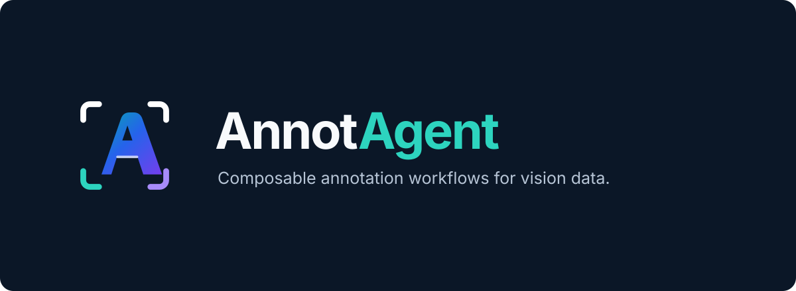
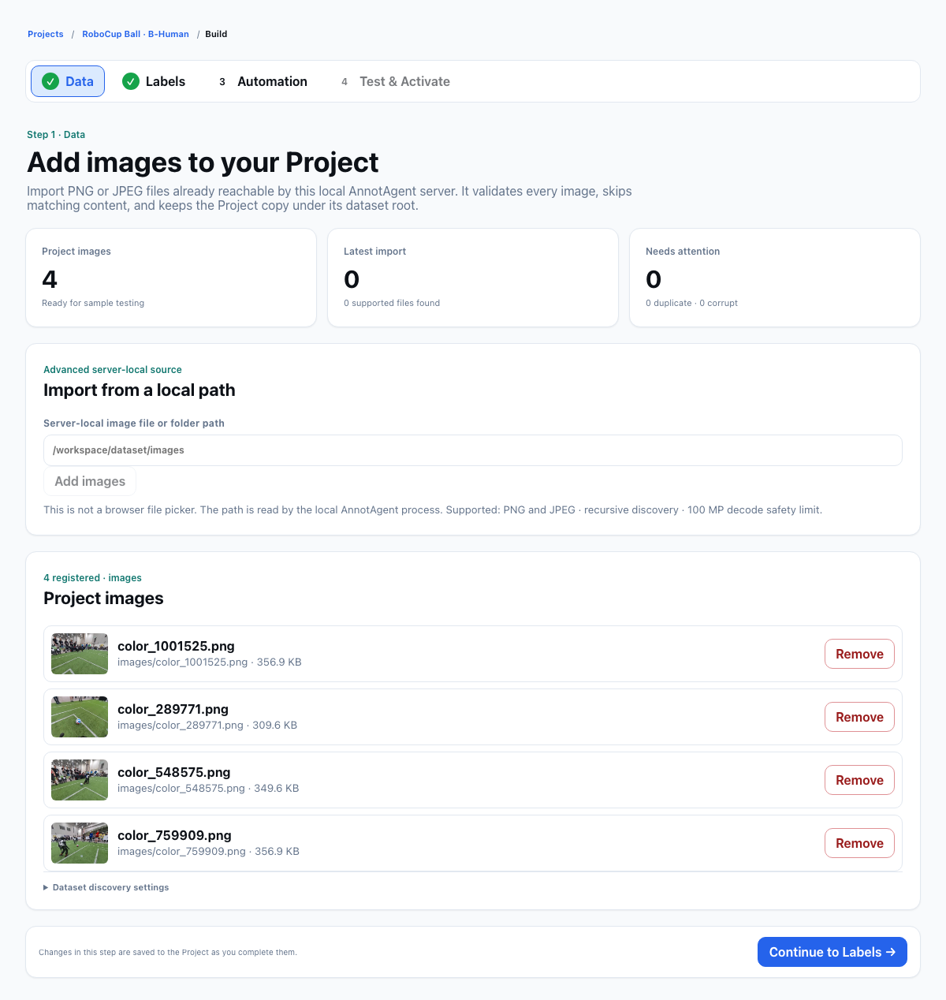
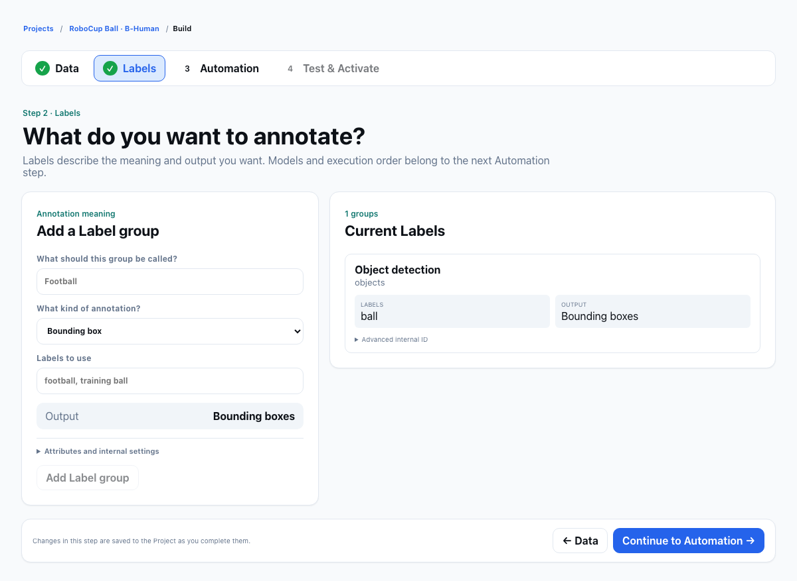
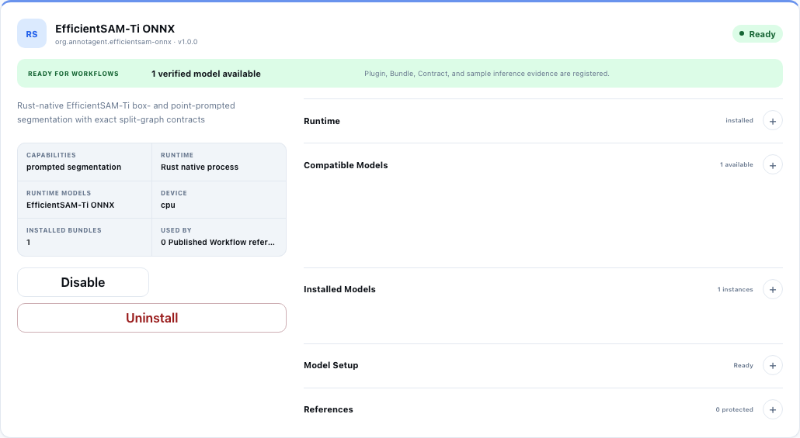

<p align="center">
  
</p>

<p align="center">
  让模型完成初步标注，让你掌握最终质量。
</p>

<p align="center">
  <a href="#从图片到数据集">产品体验</a> ·
  <a href="#接入你自己的模型">模型接入</a> ·
  <a href="#开始使用">开始使用</a> ·
  <a href="docs/DEVELOPMENT.md">开发文档</a>
</p>

AnnotAgent 是一个本地运行的 AI 辅助图像标注工作台。你定义要标注什么，
让 Agent 帮你组织模型和处理步骤，先用少量图片检查效果，再批量运行、人工审核并导出数据集。

它适合需要反复调整标注方法的视觉项目：整图分类、目标检测，以及检测后的裁剪、分类和分割细化。
你不必把所有任务交给同一个模型，也不必把模型给出的第一个结果直接当成正确答案。

> 当前为 Alpha。工作台支持 English / 简体中文。下方是实际 B-Human 足球项目与本地
> EfficientSAM 安装状态的界面截图，不是概念设计图，也不代表标注准确率评测。

## 为什么使用 AnnotAgent

- **从标注目标开始。** 在 Project 中管理图片与 Label；“标什么”和“用什么方法标”分别设置。
- **让 Agent 帮你搭流程。** 根据标签、可用模型和约束提出可编辑草稿，最终是否启用由你决定。
- **先看效果，再跑全量。** 用 1～10 张图片测试，检查结果、待审核项、耗时与模型用量。
- **看得见每一步。** 不只看最终框，也能检查模型输入、裁剪图、分割结果和失败原因。
- **把人工审核留在流程里。** 不确定的结果进入审核队列，可以修改、接受或拒绝。
- **保留可追溯的版本。** 正式运行绑定已发布版本；修改草稿不会悄悄改变过去的运行。

## 从图片到数据集

### 1. 带上你的图片，建立一个专注的项目

一个 Project 对应一项标注工作。导入本地 PNG / JPEG 图片后，在同一个项目内完成标签配置、
自动化、测试、运行、审核和导出。项目首页会提示当前还缺什么、下一步该做什么。

例如，RoboCup Ball 项目只关心足球：场上的机器人、白色鞋子和场线是需要区分的背景，
不必为了标球同时定义所有场景对象。



*真实场景：四张 B-Human 图片已进入项目；数据页展示图片预览和导入状态。*

### 2. 定义你想得到的标注

在 Labels 页面选择标注类型、填写类别。你可以让一个项目判断整张图片的类别，
也可以要求输出指定目标的边界框。后续更换模型或调整处理顺序，不需要重新定义标签含义。



*这个项目的输出是 ball 的边界框，模型选择留在下一步 Automation。*

### 3. 让 Agent 提出方法，你来决定

进入 Automation，选择 Builder LLM、目标 Label，以及准确率、速度或成本方面的偏好，
然后使用 **Ask AnnotAgent**。它会查询已登记的能力，尝试生成可编辑的 Pipeline Draft。

Builder LLM 负责规划，真正处理图片的是流程中绑定的视觉模型。
你可以查看计划中的模型调用、编辑支持的节点设置，也可以从已有模板开始。

草稿不等于已发布流程。模型连接缺失、类型不兼容或验证不通过时，需要先解决问题；
Agent 的建议不会自动成为正式运行版本。

### 4. 先试几张，检查模型到底做了什么

在 **Test & Activate** 里选取少量图片进行 Sample Test。测试不会写入正式标注。

除了看最终结果，还可以检查每张图的中间产物：检测框、Crop、分类结果、
分割 Mask，以及实际执行过的节点。哪里失败了、是否真的调用了某个模型，
都应通过运行证据确认，而不是只看流程中有没有写上它的名字。

确认效果后，激活草稿并发布固定版本，再从 Project 启动全量 Dataset Run。
运行记录保留进度、错误、用量与版本信息；支持暂停、恢复和取消。

### 5. 审核不确定结果，导出可用数据

**Results** 用来查看最终结果，**Debug** 用来排查处理过程，**Review** 用来做人工决定。

在审核画布里查看原图与标注，缩放检查边界，编辑支持的边界框，然后接受或拒绝。
模型分数与框的几何质量分别展示：高置信度不意味着框一定准确。

审核完成后，在 **Export** 选择与标签兼容的格式。支持 AnnotAgent Native，
以及按 Schema 兼容性提供的 COCO、YOLO、LabelMe 导出；不能保留的信息会在兼容性报告中说明。

## 接入你自己的模型

AnnotAgent 把“规划流程”和“处理图像”分开。你可以组合使用不同模型，而不是绑定一个固定服务。

| 角色 | 在产品里做什么 | 在哪里配置 |
| --- | --- | --- |
| Builder LLM | 理解标注目标、建议和修改流程草稿 | Settings → Providers / Models，再在 Automation 中选择 |
| VLM / 视觉服务 | 理解图片、分类、提出检测候选 | 登记模型能力，在相应流程节点中绑定 |
| 本地专家模型 | 执行支持的分割或检测任务 | Settings → Expert Model Plugins |

Provider 支持预设和 OpenAI-compatible 接入；自定义模型需要声明实际能力，
不能仅凭模型名字就当作支持视觉输入。

密钥默认可保存在本地工作区的受限权限文件中，重启后仍可使用，不必存进系统钥匙串。
工作区保存在本地，但**使用远程模型时，相关输入会发送给你配置的服务商**。

### 例如：用 EfficientSAM 做提示分割



*实际安装状态：EfficientSAM-Ti ONNX 已 Ready；卡片也如实显示当前没有已发布流程引用它。*

安装兼容 Plugin 和 Model Bundle，并通过检查后，模型才会变为可选的 Ready 状态。
仓库不附带所有模型权重；各模型的平台支持、许可证和安装方式需要分别确认。

**装好了 SAM，不等于每张图片都自动经过 SAM。** 还需要在流程中绑定相应分割节点，
并提供有效的框或点提示。它能细化候选区域，但无法保证修复一个根本没有找到目标的错误框。
VLM 的粗定位、局部检查、分割细化和人工审核应根据任务与实际证据组合。

参阅 [真实 EfficientSAM 安装指南](docs/REAL_MODEL_RELEASE.md#gui-installation)、
[模型接入](docs/PROVIDER_MODEL_REGISTRY.md)和[专家模型配置](docs/EXPERT_MODEL_ONBOARDING.md)。

## 效果不好时，不必从头重来

先用单张图片的节点证据定位问题：是模型没找到目标，裁剪范围不对，还是分割提示不可靠？

你可以调整草稿，再做 Sample Test；也可以在满足前置条件时使用 **Improve Automation**，
基于已审核证据生成改进草稿并进行对比。支持的节点 Replay 可以复用已保存的上游产物，
减少排查时不必要的重复执行。改进仍需人工确认，不会自动发布，也不等于自动训练模型。

了解[几何质量与 VLM 边界](docs/VLM_GEOMETRY_SAFETY.md)和[基于证据改进流程](docs/PIPELINE_SELF_IMPROVEMENT.md)。

## 开始使用

目前从源码启动，需要 stable Rust、Node.js 20+ 和 npm。在仓库根目录运行：

```bash
npm --prefix web install
npm --prefix web run build
cargo run -p annotagent -- serve --workspace ./workspace --open
```

打开 [本地工作台](http://127.0.0.1:8787)，然后：

1. 在 **Settings → Providers / Models** 配置自己的模型连接。
2. 在 **Projects → New project** 创建项目，导入图片并定义 Label。
3. 在 **Automation** 创建草稿，检查模型绑定。
4. **Test & Activate → Dataset Run → Review → Export**，完成第一轮标注。

页头的 **Language / 语言** 可以切换中文，选择会保存在浏览器中。
项目配置、草稿和运行记录保存在本地工作区；备份时请保留工作区和应用历史数据库。

## 当前适用范围

AnnotAgent 目前面向本地、单用户的图像标注工作，不是多用户云协作平台。
视频标注、模型训练和分布式调度不在当前 Alpha 范围内。
部分 Mask 格式还不能在画布中绘制或编辑，专家模型也不是全部开箱即用。

模型可运行与标注准确是两件事。请用自己的代表性图片测试，并对关键数据保留人工审核。
不要将本地服务直接暴露到公网。

## 继续了解

- [完整使用流程](docs/GUIDED_EXPERIENCE.md) · [项目创建](docs/GUIDED_PROJECT_SETUP.md)
- [运行与人工审核](docs/RUN_AND_REVIEW_UX.md) · [界面语言](docs/I18N.md)
- [已知限制](docs/KNOWN_LIMITATIONS.md) · [安全说明](docs/SECURITY.md)
- [开发、架构与测试](docs/DEVELOPMENT.md) · [插件开发](docs/WRITING_A_RUST_MODEL_PLUGIN.md)
- [产品截图来源](docs/product/README.md)
