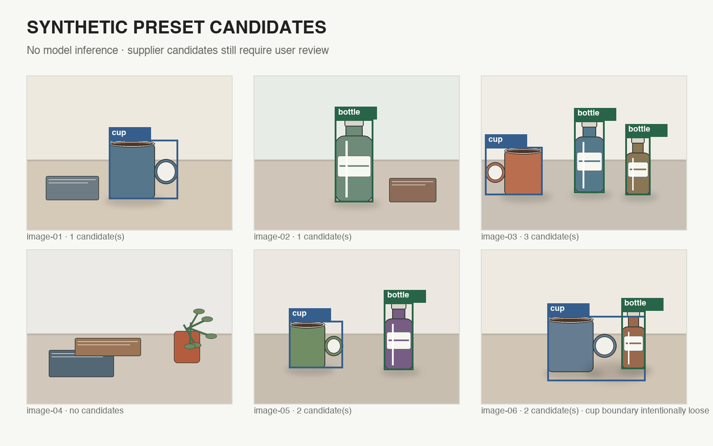

# Guided demo product assets

P0 contains one offline six-image object-detection pack:

- `object-detection-review@1.0.0`
- display name: 标注桌面物品
- labels: `cup`, `bottle`
- target: Ultralytics YOLO detection v1
- sources: original procedural synthetic images, CC0-1.0
- fixed split: image-01 through image-04 train; image-05 and image-06 validation
- modes: live model or preset candidates

The overlay above is a product-asset review sheet, not an AnnotAgent UI screenshot.
The original images and UI thumbnails contain no boxes. `image-06` intentionally has
one loose cup candidate that includes its cast shadow; it remains pending user review.

Files:

- [Pack README](../../../examples/demo-packs/object-detection-review/1.0.0/README.md)
- [Attribution and data license](../../../examples/demo-packs/object-detection-review/1.0.0/ATTRIBUTION.md)
- [Manifest](../../../examples/demo-packs/object-detection-review/1.0.0/manifest.json)
- [Preset candidates](../../../examples/demo-packs/object-detection-review/1.0.0/references/candidates.json)
- [Approved copy](ONBOARDING_COPY.md)
- [Product handoff](../../handoff/DEMO_PRODUCT.md)

No final-product screenshot is included yet. It must come from the final integrated
application and record application SHA, URL, mode, viewport, data source, whether a
model was invoked, and whether the screenshot was cropped or redacted.
