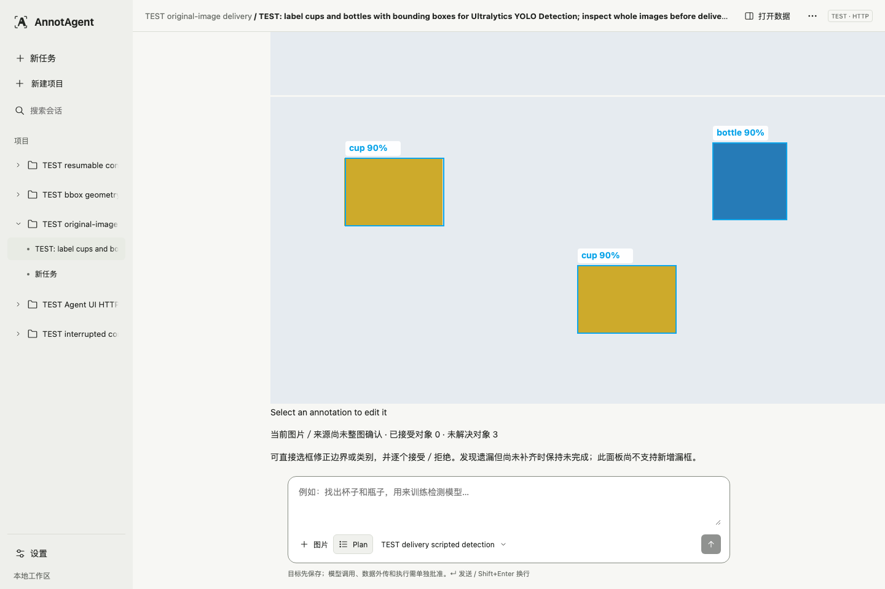
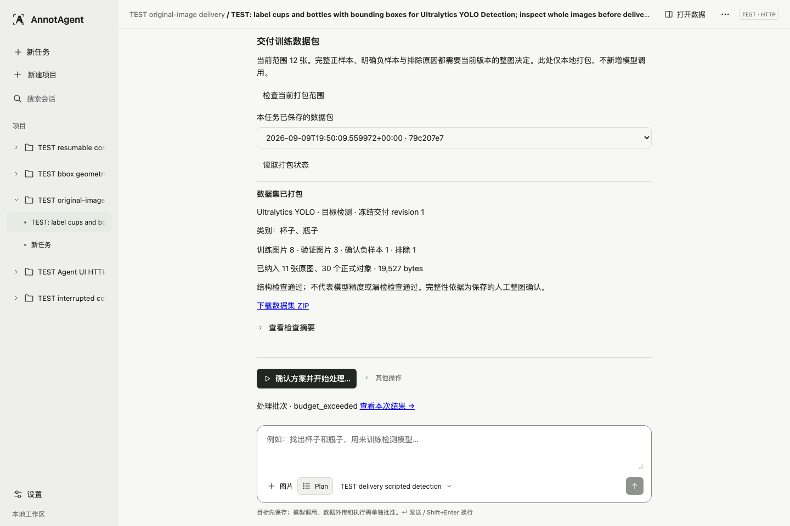

# 截图与证据范围

## 真实足球样例

2026-09-12 重新拍摄既有任务，1600×1000，浅色，完整应用视口。没有提交编辑、调用模型、修改数据库或隐藏警告。截图只有当前可见消息，不附完整聊天或上下文归档。服务端为历史演示构建，前端静态资源不具有可证明的单一构建 SHA；不能标为本轮最终集成 UI。

真实模型依据是已有 provider recovery 记录中的 Qwen 视觉定位与 EfficientSAM 执行，不是截图本身证明模型运行。该图不能证明训练用途已经保存、正式审核完成、最终数据包已交付或准确率达标。

## 正式审核机制：独立 TEST 数据

复用工程师已有真实 HTTP 界面截图，完整 1440×960。图片为测试色块，模型为 scripted detection；不是杯子或瓶子的真实视觉识别。截图证明正式对象与整图状态的界面呈现，当前画面未展示修改后的保存回执，不能冒充已经保存的真实人工修正。

## 数据包机制：独立 TEST 数据

复用实际 TEST HTTP 交付图：范围 12 张，训练 8、验证 3、确认负样本 1、排除 1；包包含 11 张图和 30 个对象。保留 budget_exhausted 与“结构检查不代表精度”的原始提示。此图不是上述 B-Human 任务，也不是模型准确性验证。

本轮已只读打开工程师留存的对应 ZIP，核对 19,527 bytes、SHA-256 与 28 个条目并通过 CRC 检查。没有重新下载或运行训练验证。包内容契约另见 GUIDE；来源工程师的测试图不能替代最终集成版与真实图片的同任务证据。
